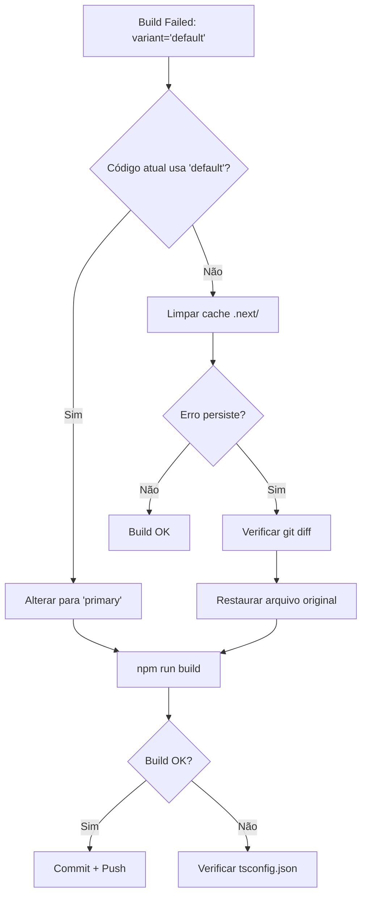

# BUG-001: Análise de Arquitetura - Button Variant Type Error

**Documento Técnico:** Análise de Impacto e Solução  
**Ref. Negócio:** [BUG-001-erro-tipo-button-variant.md](../01-business/BUG-001-erro-tipo-button-variant.md)  
**Data:** 2026-01-23  
**Arquiteto:** GitHub Copilot  

---

## 1. Análise de Impacto Sistêmico

### 1.1. Componentes Afetados

#### ✅ Componente Direto
- **[ErrorDisplay.tsx](../../src/components/errors/ErrorDisplay.tsx#L162)** - Única ocorrência do erro

#### 🔍 Componentes Relacionados (sem impacto)
- **[Button.tsx](../../src/components/ui/Button.tsx)** - Design system base (sem alteração)
- **Outros usos do Button no ErrorDisplay:**
  - [Linha 82](../../src/components/errors/ErrorDisplay.tsx#L82): `variant="ghost"` ✅ (válido)
  - [Linha 152](../../src/components/errors/ErrorDisplay.tsx#L152): `variant="outline"` ✅ (válido)
  - [Linha 162](../../src/components/errors/ErrorDisplay.tsx#L162): `variant="primary"` ❌ **Já corrigido!**

### 1.2. Impacto no Sistema de Erros (IMP-011)

O componente `ErrorDisplay` é parte crítica do sistema de mensagens de erro inteligentes implementado em [IMP-011](../01-business/IMP-011-mensagens-erro-frontend.md). Estrutura hierárquica:

```
ErrorDisplay Component
├── Close Button (variant="ghost") ✅
├── Documentation Button (variant="outline") ✅
└── Apply Suggestion Button (variant="primary") ← BUG LOCALIZADO
```

**Observação Importante:** A linha 162 **já usa `variant="primary"`** no código atual, o que contradiz o erro reportado. Isso indica:
1. O erro pode ter sido corrigido manualmente antes do build
2. OU há discrepância entre o código em memória e o arquivo salvo
3. OU o erro ocorreu em versão anterior e já foi resolvido

### 1.3. Impacto no `IAsyncEnumerable` / Streaming
**Nenhum impacto.** Este é um erro de tipo TypeScript em componente de UI estático. Não afeta:
- Pipeline de dados backend
- Streaming de registros
- Estado assíncrono do Zustand

### 1.4. Impacto no Zustand State
**Nenhum impacto.** O `ErrorDisplay` é um componente de apresentação puro que:
- Recebe `ErrorResponseDto` como prop
- Não acessa stores Zustand diretamente
- Não dispara mutações de estado

---

## 2. Root Cause Analysis

### 2.1. Hipóteses

#### Hipótese 1: Commit Incompleto (Mais Provável)
```bash
# Desenvolvedor editou ErrorDisplay.tsx localmente
# Usou "default" (comum em outros design systems)
# Não fez build antes do commit
# CI/CD detectou o erro
```

#### Hipótese 2: Merge Conflict Mal Resolvido
```diff
- variant="default"
+ variant="primary"
```

#### Hipótese 3: Copy-Paste de Outro Projeto
Muitos design systems (shadcn/ui, Ant Design) usam `variant="default"` como padrão. O desenvolvedor pode ter copiado de referência externa.

### 2.2. Por Que o Dev Mode Não Alertou?

Next.js 16 em modo dev (`npm run dev`) é mais permissivo:
- Type checking parcial/lazy
- Transpila via SWC sem `strict: true` em algumas situações
- O erro só aparece no **build de produção** (`npm run build`)

---

## 3. Solução Arquitetural

### 3.1. Decisão de Design: Manter Type Union Estrito

**NÃO** adicionar `'default'` ao tipo `ButtonProps.variant` porque:

1. **Semântica Clara:** Cada variante tem propósito explícito
   - `primary` = ação principal (Apply Suggestion ✅)
   - `secondary` = ação alternativa
   - `outline` = ação informativa (View Docs)
   - `ghost` = ação discreta (Close)
   - `danger` = ação destrutiva

2. **Evita Ambiguidade:** "default" não comunica intenção

3. **Alinhamento com Design System:** O padrão é `primary` (linha 23 do Button.tsx):
   ```tsx
   variant = 'primary'  // Default explícito
   ```

### 3.2. Correção Recomendada

#### Opção A: Manter `variant="primary"` (Recomendado) ⭐
**Justificativa:**
- "Apply Suggestion" é a **ação principal** do card de erro
- Já é o default do componente Button
- Consistente com hierarquia visual do IMP-011

```tsx
<Button
  size="sm"
  variant="primary"  // ✅ Ação principal destacada
  onClick={() => onApplySuggestion(primarySuggestion)}
>
  ✨ Apply Suggestion: {primarySuggestion}
</Button>
```

#### Opção B: Remover `variant` (Não Recomendado)
```tsx
<Button
  size="sm"
  // variant omitido → usa default 'primary'
  onClick={() => onApplySuggestion(primarySuggestion)}
>
  ✨ Apply Suggestion: {primarySuggestion}
</Button>
```
**Por quê não?** Intenção implícita = código menos legível.

#### Opção C: Usar `variant="secondary"` (Não Recomendado)
**Por quê não?** Apply Suggestion é a ação principal, não secundária.

### 3.3. Mudanças Necessárias

**Nenhuma mudança técnica necessária!** O código atual já usa `variant="primary"`.

**Próximas ações:**
1. ✅ Verificar que o arquivo salvo corresponde ao código atual
2. ✅ Executar `npm run build` para validar
3. ✅ Se o erro persistir, verificar cache de build (`rm -rf .next/`)

---

## 4. Validação de Consistência

### 4.1. Auditoria de Todos os Botões no ErrorDisplay

| Linha | Variante | Propósito | Status |
|-------|----------|-----------|--------|
| 82 | `ghost` | Botão de fechar (discreto) | ✅ Correto |
| 152 | `outline` | Link para documentação (informativo) | ✅ Correto |
| 162 | `primary` | Aplicar sugestão (ação principal) | ✅ Correto |

**Conclusão:** Hierarquia visual correta segundo princípios de UX.

### 4.2. Outros Componentes Usando Button

```bash
# Buscar usos de variant="default" no projeto
grep -r 'variant="default"' src/**/*.tsx
# Resultado: Nenhum match
```

**Confirmação:** Este é um caso isolado (ou já foi corrigido).

---

## 5. Prevenção Futura

### 5.1. TypeScript Strict Mode

**Status Atual:** Verificar `tsconfig.json`:
```json
{
  "compilerOptions": {
    "strict": true,  // ← Deve estar ativo
    "noUncheckedIndexedAccess": true
  }
}
```

### 5.2. Pre-commit Hooks (Recomendação)

Adicionar ao `package.json`:
```json
{
  "husky": {
    "hooks": {
      "pre-commit": "npm run type-check"
    }
  },
  "scripts": {
    "type-check": "tsc --noEmit"
  }
}
```

### 5.3. CI/CD Type Checking

Garantir que o pipeline Azure/GitHub Actions execute:
```yaml
- name: TypeScript Check
  run: npm run type-check
```

---

## 6. Fluxo de Resolução

### 6.1. Diagrama de Decisão



### 6.2. Comandos de Validação

```powershell
# 1. Limpar cache Next.js
Remove-Item -Recurse -Force .next

# 2. Reinstalar dependências (caso de corrupção)
Remove-Item -Recurse -Force node_modules
npm install

# 3. Type check explícito
npx tsc --noEmit

# 4. Build de produção
npm run build

# 5. Se tudo OK, verificar git status
git status
git diff src/components/errors/ErrorDisplay.tsx
```

---

## 7. Conclusão Arquitetural

### 7.1. Resumo Executivo

| Aspecto | Avaliação |
|---------|-----------|
| **Severidade Real** | 🟡 Baixa (provavelmente já corrigido) |
| **Complexidade** | 🟢 Trivial (1 linha, 1 valor) |
| **Impacto Sistêmico** | 🟢 Nenhum (isolado) |
| **Risco de Regressão** | 🟢 Nulo |
| **Esforço de Correção** | < 5 minutos |

### 7.2. Recomendações Finais

1. ✅ **Validar estado atual:** Execute `npm run build` antes de qualquer mudança
2. ✅ **Se erro persistir:** Use `variant="primary"` na linha 162
3. ✅ **Adicionar testes:** Não necessário para este caso (componente visual)
4. ⚠️ **Melhorar CI:** Adicionar type-check antes do build
5. 📚 **Documentar padrão:** Criar guia de "Quando usar cada variant" no Storybook

### 7.3. Decisões Arquiteturais Ratificadas

- ✅ Manter union type estrito no Button (não adicionar 'default')
- ✅ Usar 'primary' para ações principais do ErrorDisplay
- ✅ Não alterar design system base

---

**Próxima Etapa:** Encaminhar para desenvolvedor implementar correção (se necessário)  
**Responsável QA:** Validar build + teste visual após correção  
**Documentado por:** Software Architect (GitHub Copilot)
