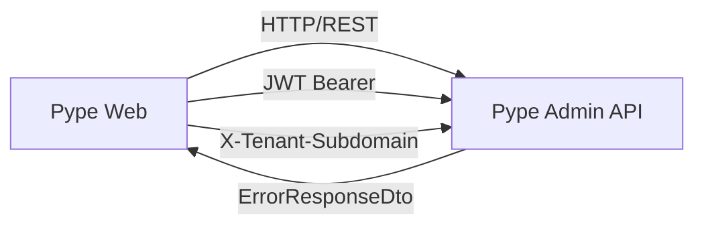
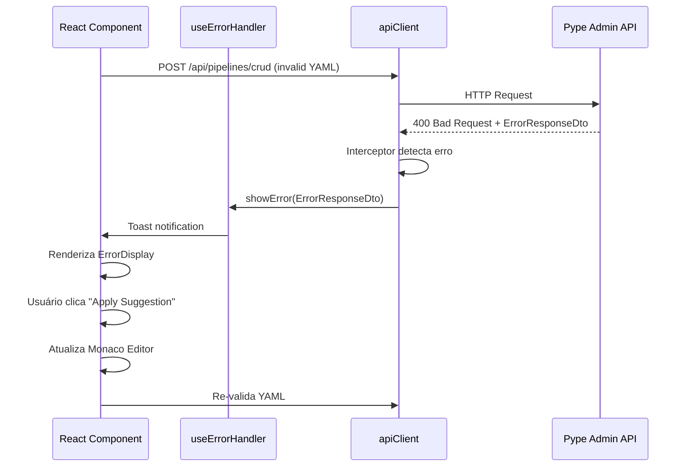
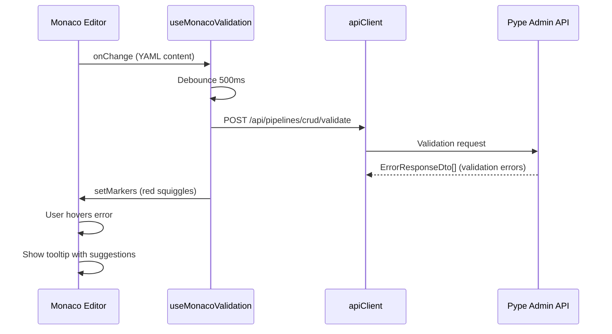

# IMP-011 Frontend - Technical Architecture Specification

**Version**: 1.0  
**Author**: GitHub Copilot (Architect Mode)  
**Date**: 2026-01-23  
**Status**: ✅ Approved for Implementation

---

## 📋 Table of Contents

1. [System Context](#system-context)
2. [Component Architecture](#component-architecture)
3. [Data Flow](#data-flow)
4. [API Integration](#api-integration)
5. [State Management](#state-management)
6. [Monaco Editor Integration](#monaco-editor-integration)
7. [Error Handling Strategy](#error-handling-strategy)
8. [Security Considerations](#security-considerations)
9. [Performance Optimization](#performance-optimization)
10. [Testing Strategy](#testing-strategy)

---

## 1. System Context

### Dependencies


### Backend API Contract
O backend já retorna `ErrorResponseDto` (RFC 7807-inspired):

```typescript
interface ErrorResponseDto {
  status: number;           // HTTP status code
  code: string;             // CONNECTOR_NOT_FOUND, INVALID_CONFIGURATION, etc.
  title: string;            // "Connector Not Found"
  detail: string;           // Full error message
  suggestions: string[];    // ["Did you mean 'httpjsonget'?"]
  documentationUrl?: string; // https://docs.pype.io/connectors
  context?: Record<string, any>; // { availableConnectors: [...] }
  traceId?: string;         // exec-8b3c7f29 (para logs)
}
```

**Status**: ✅ Backend PR #151 merged (implementação completa)

---

## 2. Component Architecture

### 2.1 Component Hierarchy

```
src/components/errors/
├── ErrorDisplay.tsx            # Main error component (Alert-based)
├── ErrorToast.tsx              # Toast notification wrapper
├── ErrorSuggestionButton.tsx   # "Apply Suggestion" button
├── ExecutionTimeline.tsx       # Timeline para runtime errors
└── index.ts                    # Barrel export

src/hooks/
├── useErrorHandler.ts          # Global error state + display logic
└── useMonacoValidation.ts      # Monaco editor YAML validation

src/lib/
├── api-client.ts               # ✏️ Modificar interceptor
└── error-formatter.ts          # Parse ErrorResponseDto
```

### 2.2 ErrorDisplay Component

**Responsibility**: Renderizar erro estruturado com sugestões

```typescript
// ErrorDisplay.tsx (já criado)
export interface ErrorDisplayProps {
  error: ErrorResponseDto;
  onApplySuggestion?: (suggestion: string) => void;
  onClose?: () => void;
  variant?: 'toast' | 'inline';
  className?: string;
}

export function ErrorDisplay({...}) {
  // - Renderiza ícone baseado em error.code
  // - Exibe title, detail, suggestions
  // - Lista availableConnectors se em context
  // - Botão "View Documentation" (documentationUrl)
  // - Botão "Apply Suggestion" (se onApplySuggestion)
  // - TraceId copiável
}
```

**Visual Output**:
```
┌────────────────────────────────────────────┐
│ ⚠️ Connector Not Found                     │
├────────────────────────────────────────────┤
│ Connector type 'httpJsonGet' not found.    │
│                                            │
│ 💡 Suggestions:                            │
│  • Did you mean 'httpjsonget'?             │
│  • Connector types are case-sensitive.     │
│                                            │
│ 📚 Available connectors:                   │
│  • httpjsonget - HTTP JSON GET Source      │
│  • mysqlsource - MySQL Source              │
│                                            │
│ Trace ID: exec-8b3c7f29 (click to copy)   │
│                                            │
│ [📖 View Documentation] [✨ Apply: httpjsonget] │
└────────────────────────────────────────────┘
```

### 2.3 useErrorHandler Hook

**Responsibility**: Gerenciar estado global de erro + integração com toast

```typescript
// src/hooks/useErrorHandler.ts
import { create } from 'zustand';
import toast from 'react-hot-toast';
import { ErrorResponseDto } from '@/types/errors';

interface ErrorState {
  currentError: ErrorResponseDto | null;
  showError: (error: ErrorResponseDto) => void;
  clearError: () => void;
  isErrorVisible: boolean;
}

export const useErrorHandler = create<ErrorState>((set) => ({
  currentError: null,
  isErrorVisible: false,
  
  showError: (error) => {
    set({ currentError: error, isErrorVisible: true });
    
    // Show toast notification
    toast.custom(
      (t) => (
        <ErrorDisplay
          error={error}
          onClose={() => toast.dismiss(t.id)}
          variant="toast"
        />
      ),
      { duration: error.status >= 500 ? 10000 : 5000 }
    );
  },
  
  clearError: () => set({ currentError: null, isErrorVisible: false }),
}));
```

### 2.4 ErrorSuggestionButton Component

**Responsibility**: Aplicar sugestão automaticamente no editor YAML

```typescript
// src/components/errors/ErrorSuggestionButton.tsx
interface ErrorSuggestionButtonProps {
  suggestion: string;          // 'httpjsonget'
  originalValue: string;        // 'httpJsonGet'
  onApply: (newValue: string) => void;
}

export function ErrorSuggestionButton({...}) {
  const handleApply = () => {
    onApply(suggestion);
    toast.success(`Applied suggestion: ${suggestion}`);
  };
  
  return (
    <Button onClick={handleApply}>
      ✨ Apply Suggestion: {suggestion}
    </Button>
  );
}
```

### 2.5 ExecutionTimeline Component

**Responsibility**: Timeline visual para erros de runtime

```typescript
// src/components/errors/ExecutionTimeline.tsx
interface TimelineStep {
  name: string;
  status: 'success' | 'failed' | 'skipped' | 'pending';
  error?: ErrorResponseDto;
  duration?: number;
}

export function ExecutionTimeline({ steps }: { steps: TimelineStep[] }) {
  // Renderiza timeline vertical com:
  // - ✅ success (verde)
  // - ❌ failed (vermelho, expandível para ver erro)
  // - ⊝ skipped (cinza)
  // - ⏳ pending (azul, pulsing)
}
```

---

## 3. Data Flow

### 3.1 Error Detection & Display Flow



### 3.2 Monaco Editor Validation Flow



---

## 4. API Integration

### 4.1 apiClient Interceptor Modification

**Arquivo**: `src/lib/api-client.ts`

**Modificação necessária** (linha ~117):

```typescript
// ANTES (atual)
this.client.interceptors.response.use(
  (response) => response,
  async (error) => {
    logger.error('API Error:', { ... });
    // ... lógica de refresh token ...
    return Promise.reject(error); // ❌ Rejeita erro bruto
  }
);

// DEPOIS (com ErrorResponseDto)
this.client.interceptors.response.use(
  (response) => response,
  async (error) => {
    logger.error('API Error:', { ... });
    
    // Parse ErrorResponseDto if available
    if (error.response?.data && isErrorResponseDto(error.response.data)) {
      const errorDto: ErrorResponseDto = error.response.data;
      
      // Dispatch to error handler (unless it's 401 retry)
      if (error.response.status !== 401 || error.config._retry) {
        useErrorHandler.getState().showError(errorDto);
      }
      
      // Enrich error object
      error.pypeError = errorDto;
    }
    
    // ... lógica de refresh token (mantém) ...
    
    return Promise.reject(error);
  }
);

function isErrorResponseDto(data: any): data is ErrorResponseDto {
  return data && typeof data.code === 'string' && typeof data.title === 'string';
}
```

### 4.2 Error Formatter Utility

```typescript
// src/lib/error-formatter.ts
export function formatErrorForDisplay(error: any): ErrorResponseDto | null {
  // Se já é ErrorResponseDto do backend
  if (error.pypeError) {
    return error.pypeError;
  }
  
  // Se é erro Axios genérico, cria ErrorResponseDto fallback
  if (error.response) {
    return {
      status: error.response.status,
      code: `HTTP_${error.response.status}`,
      title: error.response.statusText || 'Request Failed',
      detail: error.response.data?.error || error.message,
      suggestions: ['Check your network connection', 'Retry the request'],
      context: {},
    };
  }
  
  // Erro de network
  return {
    status: 0,
    code: 'NETWORK_ERROR',
    title: 'Network Error',
    detail: error.message || 'Failed to connect to server',
    suggestions: ['Check your internet connection', 'Verify the API URL'],
    context: {},
  };
}
```

---

## 5. State Management

### 5.1 Error State (Zustand)

**Arquivo**: `src/hooks/useErrorHandler.ts` (já documentado acima)

**Justificativa**:
- ✅ Zustand já está instalado e usado no projeto
- ✅ Leve (<1KB gzipped)
- ✅ Persist middleware para erros críticos (opcional)
- ✅ Sem boilerplate vs Redux

### 5.2 Monaco Editor State

**Arquivo**: `src/hooks/useMonacoValidation.ts`

```typescript
export function useMonacoValidation(editor: monaco.editor.IStandaloneCodeEditor | null) {
  const [validationErrors, setValidationErrors] = useState<ErrorResponseDto[]>([]);
  const [isValidating, setIsValidating] = useState(false);
  
  const validateYAML = useMemo(
    () =>
      debounce(async (content: string) => {
        if (!content) return;
        
        setIsValidating(true);
        try {
          const response = await apiClient.post('/api/pipelines/crud/validate', {
            yamlDefinition: content,
          });
          
          // Validation passed
          setValidationErrors([]);
          editor?.updateOptions({ readOnly: false });
          
        } catch (error: any) {
          if (error.pypeError) {
            setValidationErrors([error.pypeError]);
            
            // Set Monaco markers
            const model = editor?.getModel();
            if (model) {
              monaco.editor.setModelMarkers(model, 'pype', [
                {
                  severity: monaco.MarkerSeverity.Error,
                  message: error.pypeError.detail,
                  startLineNumber: extractLineNumber(error.pypeError.context?.path),
                  startColumn: 1,
                  endLineNumber: extractLineNumber(error.pypeError.context?.path),
                  endColumn: 100,
                },
              ]);
            }
          }
        } finally {
          setIsValidating(false);
        }
      }, 500),
    [editor]
  );
  
  return { validateYAML, validationErrors, isValidating };
}
```

---

## 6. Monaco Editor Integration

### 6.1 YAML Validation Provider

**Componente**: `src/components/pipelines/PipelineEditor.tsx` (modificar existente)

**Integração**:

```typescript
import { useMonacoValidation } from '@/hooks/useMonacoValidation';

export function PipelineEditor({ initialValue, onChange }: PipelineEditorProps) {
  const [editor, setEditor] = useState<monaco.editor.IStandaloneCodeEditor | null>(null);
  const { validateYAML, validationErrors } = useMonacoValidation(editor);
  
  const handleEditorChange = (value: string | undefined) => {
    if (value) {
      onChange(value);
      validateYAML(value); // Debounced validation
    }
  };
  
  return (
    <div>
      <Editor
        height="600px"
        language="yaml"
        value={initialValue}
        onChange={handleEditorChange}
        onMount={(editorInstance) => setEditor(editorInstance)}
        options={{
          minimap: { enabled: false },
          scrollBeyondLastLine: false,
          quickSuggestions: true,
        }}
      />
      
      {/* Display validation errors inline */}
      {validationErrors.length > 0 && (
        <div className="mt-2">
          {validationErrors.map((error, idx) => (
            <ErrorDisplay
              key={idx}
              error={error}
              variant="inline"
              onApplySuggestion={(suggestion) => {
                // Apply suggestion to editor
                const currentValue = editor?.getValue() || '';
                const newValue = currentValue.replace(
                  error.context?.connectorType || '',
                  suggestion
                );
                editor?.setValue(newValue);
                onChange(newValue);
              }}
            />
          ))}
        </div>
      )}
    </div>
  );
}
```

---

## 7. Error Handling Strategy

### 7.1 Error Categories

| Categoria | HTTP Status | Comportamento |
|-----------|-------------|---------------|
| **Validation** | 400 | Inline no editor + Toast |
| **Authentication** | 401 | Auto-retry refresh token |
| **Authorization** | 403 | Toast + redirect |
| **Not Found** | 404 | Toast com sugestões |
| **Rate Limit** | 429 | Toast com retry advice |
| **Server Error** | 500+ | Toast + Contact Support button |

### 7.2 Error Recovery Actions

```typescript
const ERROR_ACTIONS: Record<string, ErrorAction[]> = {
  CONNECTOR_NOT_FOUND: [
    { label: 'Apply Suggestion', handler: applySuggestion },
    { label: 'View Connectors Docs', handler: openDocs },
  ],
  INVALID_CONFIGURATION: [
    { label: 'View Example', handler: showExample },
    { label: 'Validate Again', handler: revalidate },
  ],
  AUTH_PROFILE_NOT_FOUND: [
    { label: 'Create Auth Profile', handler: navigateToAuthProfiles },
    { label: 'View Available Profiles', handler: listProfiles },
  ],
  HTTP_401_UNAUTHORIZED: [
    { label: 'Retry', handler: retry },
    { label: 'Check Auth Profile', handler: viewAuthProfile },
  ],
  HTTP_429_RATE_LIMIT: [
    { label: 'Retry After 60s', handler: () => setTimeout(retry, 60000) },
  ],
};
```

---

## 8. Security Considerations

### 8.1 Data Exposure

✅ **SAFE**: Backend já filtra `TenantId` do `PublicContext`  
✅ **SAFE**: `traceId` é seguro expor (apenas ExecutionId)  
❌ **UNSAFE**: Não exibir `context.ResponseBody` (está no backend InternalContext)

### 8.2 XSS Prevention

```typescript
// ✅ CORRETO: React escapa automaticamente
<p>{error.detail}</p>

// ❌ INSEGURO: Nunca usar dangerouslySetInnerHTML com error.detail
<div dangerouslySetInnerHTML={{ __html: error.detail }} />
```

### 8.3 Sensitive Data in Logs

```typescript
// src/hooks/useErrorHandler.ts
showError: (error) => {
  // ✅ Log sanitizado (sem context sensível)
  logger.info('Displaying error:', {
    code: error.code,
    status: error.status,
    traceId: error.traceId,
    // ❌ NÃO logar error.context (pode ter dados sensíveis)
  });
  
  set({ currentError: error });
}
```

---

## 9. Performance Optimization

### 9.1 Debouncing

- **Monaco validation**: 500ms debounce (já implementado)
- **API retry**: Exponential backoff (1s, 2s, 4s, 8s)

### 9.2 Toast Limits

```typescript
// Máximo 3 toasts simultâneos
toast.custom((t) => <ErrorDisplay />, {
  duration: 5000,
  position: 'top-right',
  // Evitar spam
  id: error.code, // Mesmo erro só aparece 1x
});
```

### 9.3 Lazy Loading

```typescript
// Carregar ExecutionTimeline apenas quando necessário
const ExecutionTimeline = lazy(() => import('@/components/errors/ExecutionTimeline'));
```

---

## 10. Testing Strategy

### 10.1 Unit Tests

```typescript
// src/__tests__/components/errors/ErrorDisplay.test.tsx
describe('ErrorDisplay', () => {
  it('renders error title and detail', () => {
    const error: ErrorResponseDto = {
      status: 400,
      code: 'CONNECTOR_NOT_FOUND',
      title: 'Connector Not Found',
      detail: "Connector type 'httpJsonGet' not found.",
      suggestions: ["Did you mean 'httpjsonget'?"],
    };
    
    render(<ErrorDisplay error={error} />);
    
    expect(screen.getByText('Connector Not Found')).toBeInTheDocument();
    expect(screen.getByText(/httpJsonGet/)).toBeInTheDocument();
    expect(screen.getByText(/Did you mean 'httpjsonget'/)).toBeInTheDocument();
  });
  
  it('calls onApplySuggestion when button clicked', async () => {
    const onApply = jest.fn();
    const error: ErrorResponseDto = { /* ... */ };
    
    render(<ErrorDisplay error={error} onApplySuggestion={onApply} />);
    
    const button = screen.getByText(/Apply Suggestion/);
    await userEvent.click(button);
    
    expect(onApply).toHaveBeenCalledWith('httpjsonget');
  });
});
```

### 10.2 Integration Tests

```typescript
// src/__tests__/hooks/useErrorHandler.test.ts
describe('useErrorHandler', () => {
  it('displays toast when showError is called', () => {
    const { result } = renderHook(() => useErrorHandler());
    
    act(() => {
      result.current.showError({
        status: 400,
        code: 'TEST_ERROR',
        title: 'Test Error',
        detail: 'Test detail',
        suggestions: [],
      });
    });
    
    expect(result.current.isErrorVisible).toBe(true);
    expect(toast.custom).toHaveBeenCalled();
  });
});
```

### 10.3 E2E Tests (Gherkin)

**Cenário 1**: Exibição de erro estruturado
```typescript
// cypress/e2e/error-display.cy.ts
it('displays connector not found error with suggestions', () => {
  cy.intercept('POST', '/api/pipelines/crud', {
    statusCode: 400,
    body: {
      code: 'CONNECTOR_NOT_FOUND',
      title: 'Connector Not Found',
      detail: "Connector type 'httpJsonGet' not found.",
      suggestions: ["Did you mean 'httpjsonget'?"],
      documentationUrl: 'https://docs.pype.io/connectors',
      context: {
        availableConnectors: [
          { type: 'httpjsonget', name: 'HTTP JSON GET' }
        ]
      }
    }
  });
  
  cy.visit('/pipelines/new');
  cy.get('[data-testid="save-pipeline"]').click();
  
  cy.get('[data-testid="error-display"]').should('be.visible');
  cy.contains("Did you mean 'httpjsonget'?").should('exist');
  cy.contains('View Documentation').should('exist');
});
```

---

## 11. Migration Plan

### Phase 1: Foundation (2h)
- ✅ Create `ErrorResponseDto` types
- ✅ Create `ErrorDisplay` component
- Modify `apiClient` interceptor
- Create `useErrorHandler` hook

### Phase 2: Integration (1h)
- Integrate with existing error flows
- Update pipeline editor
- Update execution details page

### Phase 3: Monaco (2h)
- Create `useMonacoValidation` hook
- Integrate with `PipelineEditor`
- Add inline error markers

### Phase 4: Timeline (2h)
- Create `ExecutionTimeline` component
- Integrate with execution details
- Add expand/collapse for error details

### Phase 5: Testing (2h)
- Unit tests for components
- Integration tests for hooks
- E2E tests for Gherkin scenarios

---

## 12. Rollout Strategy

### 12.1 Feature Flag (Optional)

```typescript
// src/constants/features.ts
export const FEATURES = {
  ENHANCED_ERROR_MESSAGES: process.env.NEXT_PUBLIC_ENHANCED_ERRORS === 'true',
};

// Uso
if (FEATURES.ENHANCED_ERROR_MESSAGES && error.pypeError) {
  useErrorHandler.getState().showError(error.pypeError);
} else {
  // Fallback para erro legado
  toast.error(error.message);
}
```

### 12.2 Gradual Rollout

1. **Week 1**: Deploy com feature flag OFF (apenas backend funcionando)
2. **Week 2**: Enable para 10% dos usuários
3. **Week 3**: Enable para 50% dos usuários
4. **Week 4**: Enable para 100% + remover flag

---

## 13. Success Metrics

| Métrica | Baseline | Meta | Medição |
|---------|----------|------|---------|
| Time to Resolution | ~30 min | <5 min | Analytics event |
| Support Tickets (Erros) | ~20/semana | <5/semana | Zendesk |
| Error Recovery Rate | ~40% | >80% | Backend tracing |
| User Satisfaction (Errors) | 2.1/5 | >4.0/5 | In-app survey |

---

**Status**: ✅ **APPROVED FOR IMPLEMENTATION**  
**Architect**: GitHub Copilot  
**Reviewer**: (Pending)  
**Date**: 2026-01-23
