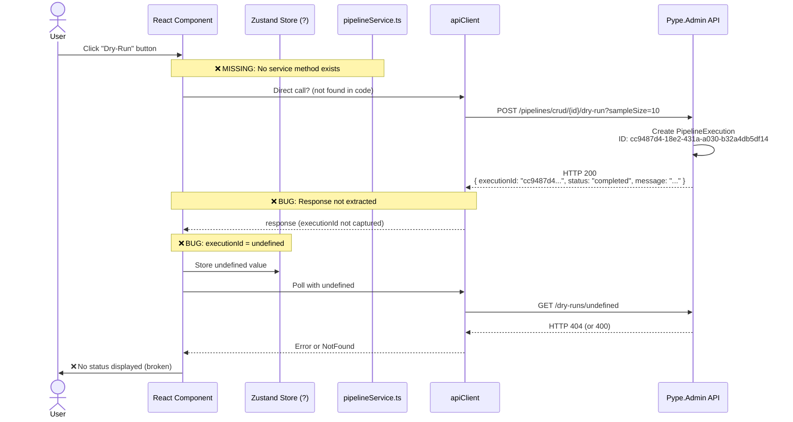
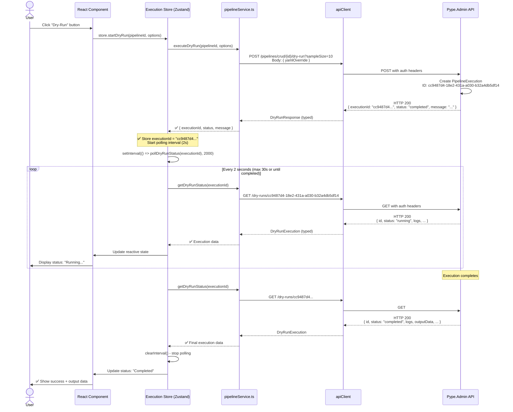
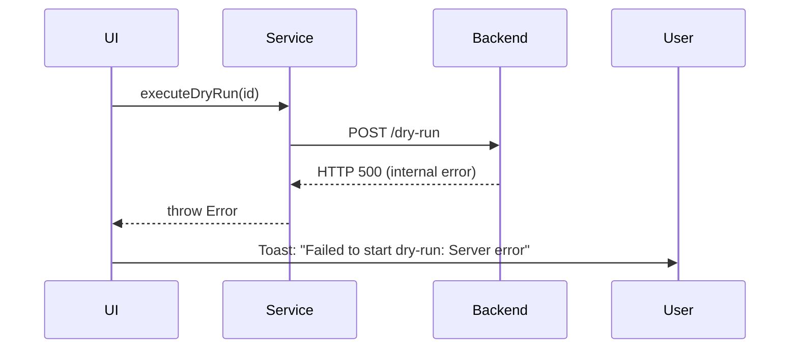
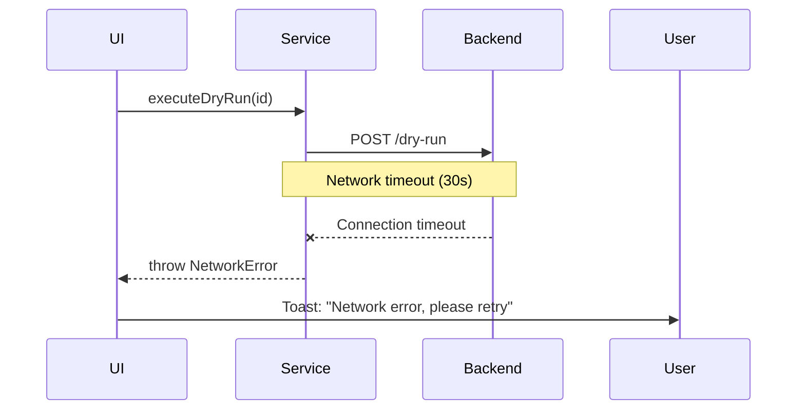
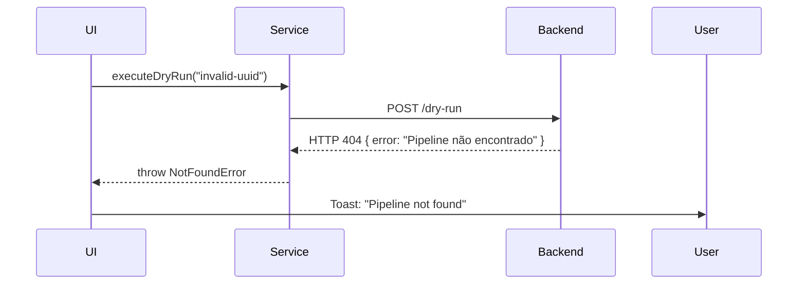
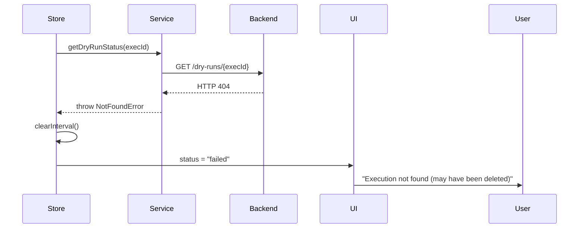

# BUG-003: Dry-Run Execution Flow Diagram

**Related Documents:**
- [Business Spec](../../01-business/BUG-003-dry-run-executionid-undefined.md)
- [Executive Summary](../BUG-003-executive-summary.md)
- [ADR-003](../decisions/ADR-003-fix-dry-run-response-handling.md)

---

## 🔴 Current (Broken) Flow



### Problems Identified
1. **Missing Service Method:** No `executeDryRun()` method in `pipelineService.ts`
2. **Response Not Extracted:** `response.data.executionId` not captured
3. **State Management Gap:** No Zustand store tracking dry-run execution
4. **Polling with Undefined:** `GET /dry-runs/undefined` called instead of actual UUID

---

## 🟢 Expected (Fixed) Flow



### Fixes Applied
1. ✅ **Service Method Added:** `pipelineService.executeDryRun(id, options)`
2. ✅ **Response Extracted:** `const { executionId } = await executeDryRun(...)`
3. ✅ **State Management:** Zustand store tracks execution with polling
4. ✅ **Valid Polling:** `GET /dry-runs/{executionId}` with actual UUID

---

## 📊 Data Flow Architecture

### Request/Response Chain

```
┌─────────────┐
│    User     │
└──────┬──────┘
       │ Click "Dry-Run"
       ▼
┌─────────────────────────────────────┐
│   React Component (UI Layer)        │
│   - Trigger button                  │
│   - Display modal with progress     │
└──────┬──────────────────────────────┘
       │ useExecutionStore().startDryRun(id)
       ▼
┌─────────────────────────────────────┐
│   Zustand Store (State Layer)       │
│   - activeDryRuns: Map<id, exec>    │
│   - startDryRun(id, opts)           │
│   - pollDryRunStatus(execId)        │
└──────┬──────────────────────────────┘
       │ pipelineService.executeDryRun(id, opts)
       ▼
┌─────────────────────────────────────┐
│   PipelineService (API Layer)       │
│   - executeDryRun() → POST          │
│   - getDryRunStatus() → GET         │
└──────┬──────────────────────────────┘
       │ apiClient.post() / apiClient.get()
       ▼
┌─────────────────────────────────────┐
│   ApiClient (HTTP Layer)            │
│   - Auth interceptor (JWT)          │
│   - Tenant header (X-Tenant-Subdomain)
│   - Base URL resolver (runtime config)
└──────┬──────────────────────────────┘
       │ HTTP Request
       ▼
┌─────────────────────────────────────┐
│   Pype.Admin Backend                │
│   - Pipelines.Crud.Endpoints.cs     │
│   - PipelineCommandService          │
│   - PipelineQueryService            │
└─────────────────────────────────────┘
```

---

## 🔄 Polling Lifecycle

### State Machine

```
┌──────────────┐
│    IDLE      │ ← Initial state (no active dry-run)
└──────┬───────┘
       │ startDryRun(id)
       ▼
┌──────────────┐
│  STARTING    │ ← POST /dry-run in flight
└──────┬───────┘
       │ POST returns executionId
       ▼
┌──────────────┐
│   POLLING    │ ← setInterval(pollStatus, 2000ms)
└──────┬───────┘
       │
       ├─ Every 2s ──┬─→ GET /dry-runs/{id} → status: "pending"   ─┐
       │             ├─→ GET /dry-runs/{id} → status: "running"   ─┤
       │             └─→ GET /dry-runs/{id} → status: "completed" ─┘
       │                                           │
       │                  ┌────────────────────────┘
       │                  │ (OR after 30s timeout)
       ▼                  ▼
┌──────────────┐   ┌──────────────┐
│  COMPLETED   │   │    FAILED    │
└──────────────┘   └──────────────┘
       │                  │
       └──── clearInterval() ────┘
              │
              ▼
       Remove from activeDryRuns Map
```

### Auto-Stop Conditions
1. **Status = "completed":** Stop polling, show success
2. **Status = "failed":** Stop polling, show error message
3. **Timeout (30s):** Stop polling, show "Execution timed out, check logs"
4. **Component Unmount:** clearInterval() to prevent memory leaks

---

## 🎯 TypeScript Type Flow

### Service Layer Types

```typescript
// INPUT: User triggers dry-run
interface DryRunOptions {
  yamlOverride?: string;  // Custom YAML (optional)
  sampleSize?: number;    // Row limit for testing
}

// OUTPUT: Backend response after creating dry-run
interface DryRunResponse {
  executionId: string;    // ✅ UUID v4
  status: string;         // "completed" (immediate for dry-run)
  message: string;        // "Dry-run criado com sucesso"
}

// POLLING: Backend response from status endpoint
interface DryRunExecution {
  id: string;             // executionId
  pipelineId: string;     // Original pipeline UUID
  status: ExecutionStatus; // 'pending' | 'running' | 'completed' | 'failed'
  startedAt: string;      // ISO 8601 timestamp
  completedAt?: string;   // ISO 8601 timestamp (when finished)
  logs?: string;          // Execution logs (JSON string)
  outputData?: string;    // Sample output data (JSON string)
  errorMessage?: string;  // Error details (if failed)
}

enum ExecutionStatus {
  Pending = 'pending',
  Running = 'running',
  Completed = 'completed',
  Failed = 'failed'
}
```

---

## 🧪 Error Scenarios

### Scenario 1: Backend API Error (500)


### Scenario 2: Network Timeout


### Scenario 3: Pipeline Not Found (404)


### Scenario 4: Polling Returns 404 (execution deleted)


---

## 📝 Implementation Checklist

### Phase 1: Service Layer
- [ ] Add `DryRunOptions` interface to `pipelineService.ts`
- [ ] Add `DryRunResponse` interface to `pipelineService.ts`
- [ ] Add `DryRunExecution` interface to `pipelineService.ts`
- [ ] Implement `executeDryRun(id, options)` method
- [ ] Implement `getDryRunStatus(executionId)` method
- [ ] Add proper error handling (try/catch)
- [ ] Export new types from `src/types/index.ts`

### Phase 2: State Management
- [ ] Create `src/store/executions.ts` (or extend existing store)
- [ ] Add `activeDryRuns: Map<string, DryRunExecution>` state
- [ ] Implement `startDryRun(id, opts)` action
- [ ] Implement `pollDryRunStatus(execId)` action with setInterval
- [ ] Implement `stopPolling(execId)` action with clearInterval
- [ ] Add cleanup on component unmount

### Phase 3: UI Components
- [ ] Add "Dry-Run" button to pipeline detail/editor
- [ ] Create DryRunModal/Drawer component
- [ ] Display execution status badge (pending/running/completed/failed)
- [ ] Stream logs in real-time from polling
- [ ] Show error messages on failure
- [ ] Add loading spinner during STARTING phase

### Phase 4: Testing
- [ ] Manual test: POST returns executionId
- [ ] Manual test: Polling uses correct UUID (not "undefined")
- [ ] Manual test: UI updates every 2 seconds
- [ ] Manual test: Polling stops after completion
- [ ] Manual test: Error handling displays user-friendly message
- [ ] Validate all 4 QA criteria from business spec

---

**Status:** 📐 Diagram Complete - Ready for Developer Reference
